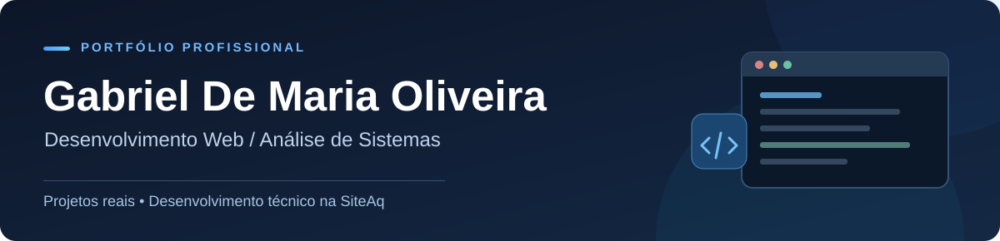

### Desenvolvimento web com foco em soluções funcionais

**Desenvolvedor Web · Análise de Sistemas · Desenvolvimento técnico na SiteAq**

[**LinkedIn**](https://www.linkedin.com/in/gabriel-de-maria-oliveira/) · [**Projetos**](#projetos-em-destaque) · [**E-mail**](mailto:gabriel.demaria@hotmail.com)

---

### Sobre

Sou profissional de TI, com experiência em **desenvolvimento web, análise de sistemas e suporte técnico especializado**. Na **SiteAq**, respondo pelo desenvolvimento técnico de projetos digitais, unindo implementação, resolução de problemas e atenção à experiência de uso.

### Projetos em destaque

<table>
<tr>
<td width="50%" valign="top">

**Joyce Gandra · Psicologia**

Site institucional desenvolvido para a presença digital da profissional.

[**Portfólio →**](https://github.com/GabrielDeMariaOliveira/portfolio-joyce-gandra) · [Site publicado ↗](https://psijoycegandra.com.br/)

</td>
<td width="50%" valign="top">

**Ferreira &amp; Vasconcelos · Advocacia**

Site institucional para apresentação do escritório e de sua atuação profissional.

[**Portfólio →**](https://github.com/GabrielDeMariaOliveira/portfolio-ferreira-vasconcelos) · [Site publicado ↗](https://ferreiraevasconcelos.com.br/)

</td>
</tr>
</table>

Projetos realizados na **SiteAq**. Responsável pelo desenvolvimento técnico integral dos dois sites; meu sócio conduziu a frente comercial, o atendimento e participou da concepção inicial. Os códigos-fonte são privados. As imagens acima são capturas reais das versões públicas dos sites.

### Tecnologias e conhecimentos

**Desenvolvimento:** HTML5 · CSS3 · JavaScript · PHP · Python  
**Dados e ferramentas:** MySQL · PostgreSQL · Git · GitHub  
**Experiência:** Análise de sistemas · Diagnóstico técnico · Integrações · Suporte especializado

Lista de conhecimentos profissionais; a stack específica de cada projeto depende de validação.

---

**Entendemos antes de construir.** — SiteAq

[LinkedIn](https://www.linkedin.com/in/gabriel-de-maria-oliveira/) · [E-mail](mailto:gabriel.demaria@hotmail.com)

